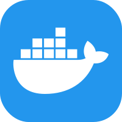
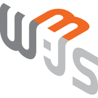
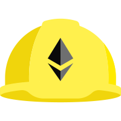
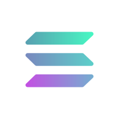

  
  
  ### Hi there, I'm Zule 👋
  
A passionate Full-Stack Developer specializing in building high-performance, scalable web applications. I leverage modern technologies like Next.js, AWS, and Blockchain to create seamless and innovative user experiences, from concept to deployment.
 
- 💬 Ask me about anything [here](https://github.com/hhzule/hhzule/issues)

### My Skills:

 
 
Frontend & Backend:
<code></code>
<code></code>
<code></code>
<code></code>
<code></code>
<code></code>

Cloud & Databases:
<code></code>
<code></code>
<code></code>
<code></code>

Blockchain & Web3:
<code></code>
<code></code>
<code></code>
<code></code>
<code></code>
<code></code>
<code></code>

Testing:
<code></code>
<code></code>
<code></code>

---

📫 Let's Connect!
I'm always open to discussing new projects, innovative ideas, or opportunities to be part of your vision.

💼 LinkedIn: Let's connect on LinkedIn https://linkedin.com/in/zule-huma

📧 Email: hhzule@gmail.com

💬 Ask me anything: Open a GitHub Q&A

